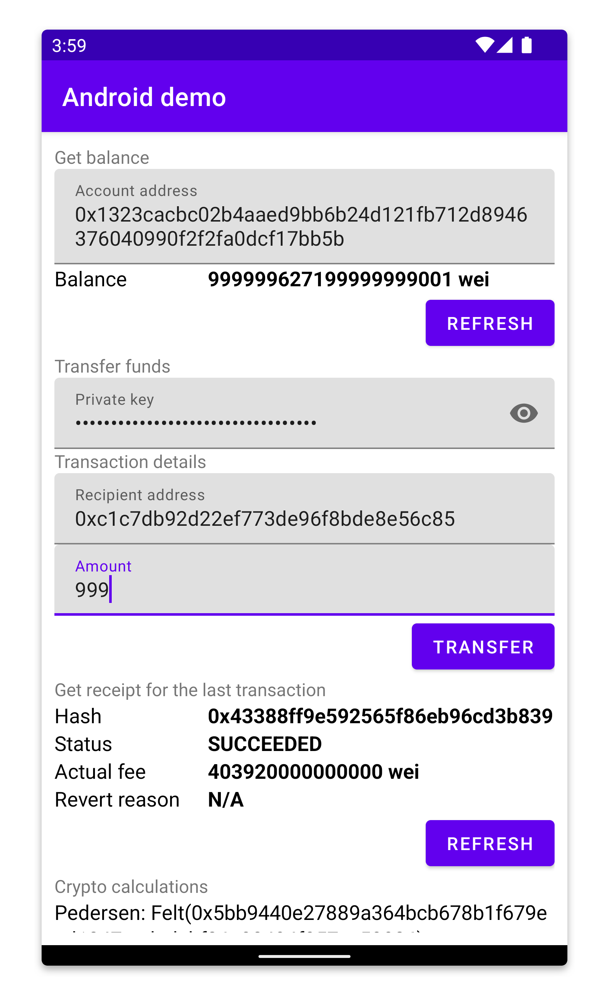

# Android demo
<p align="center">
    
</p>

## Table of contents

<!-- TOC -->
* [Android demo](#android-demo)
  * [Table of contents](#table-of-contents)
  * [Running (devnet)](#running-devnet)
    * [Prerequisites](#prerequisites)
    * [Steps](#steps)
  * [Running (networks)](#running-networks)
    * [Prerequisites](#prerequisites-1)
    * [Steps](#steps-1)
<!-- TOC -->


## Running (devnet)

### Prerequisites
- Android emulator (Android Studio, IntelliJ IDEA, etc.)
- [starknet-devnet-rs](https://github.com/0xSpaceShard/starknet-devnet-rs)

### Steps
1. Install `starknet-devnet-rs`. Since it has yet to be released, you will need to build it manually:
    ```shell
    git clone https://github.com/0xSpaceShard/starknet-devnet-rs.git starknet-devnet-rs
    cd starknet-devnet-rs
    cargo build --release
    export DEVNET_PATH=$(pwd)/target/release/starknet-devnet
    ```
2. Run devnet with specific parameters on your host machine:
    ```shell
    $DEVNET_PATH --host 127.0.0.1 --port 5050 --seed 1053545547
    ```
3. Run the `MainActivity` on the emulator.

## Running (networks)
Running the demo on a network other than devnet (Mainnet/Testen/Integration) requires some tweaks to be made.

### Prerequisites
- Android emulator (Android Studio, IntelliJ IDEA, etc.)
- URL of a Starknet RPC node.
- Account deployed on said network with some funds on it. If you're using **Sepolia testnet**, you can obtain some funds from the [faucet](https://starknet-faucet.vercel.app/).
- A valid configuration that consists of the data above:
  - `DEMO_RPC_URL` - RPC node URL
  - `DEMO_ACCOUNT_ADDRESS` - account address
  - `DEMO_ACCOUNT_PRIVATE_KEY` - account private key

### Steps
1. Set a config with your data. To do so, you can modify [build.gradle.kts](build.gradle.kts):
    ```gradle
    android {
        ...
        defaultConfig {
            ...
            buildConfigField("String", "DEMO_RPC_URL", "\"http://example-node-url.com/rpc\"")
            buildConfigField("String", "DEMO_ACCOUNT_ADDRESS", "\"0x123456789\"")
            buildConfigField("String", "DEMO_PRIVATE_KEY", "\"0x123\"")
            }
        }
    }
    ```
2. Run the `MainActivity` on the emulator.